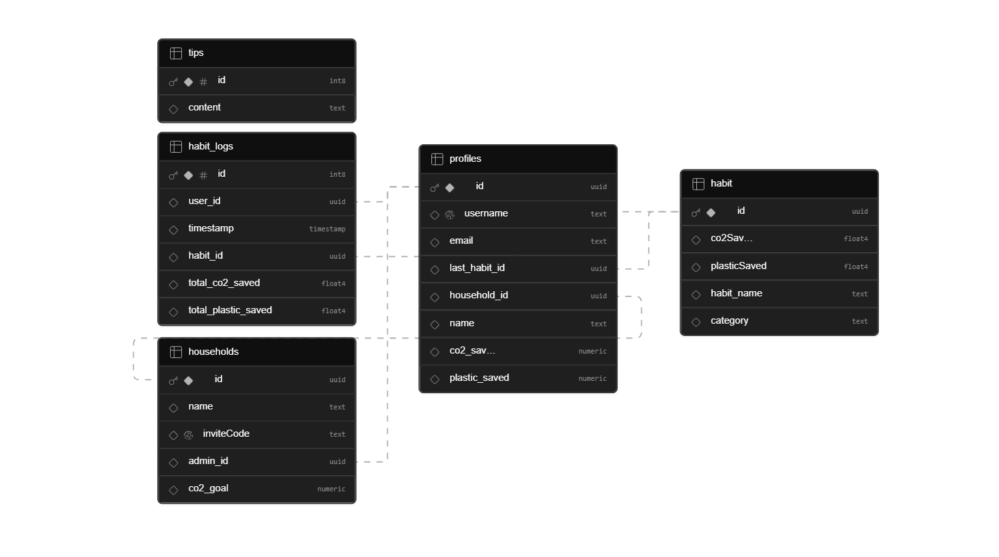

# Supabase Used For Backend Database
## Database Schema
For our project we used supabase as it provided us with an easy way to handle authentication and CRUD requests
our Database Schema Looks like this :
<br><br>

<br><br>
Copied as SQL :
``` -- WARNING: This schema is for context only and is not meant to be run.
-- Table order and constraints may not be valid for execution.

CREATE TABLE public.habit (
  id uuid NOT NULL DEFAULT gen_random_uuid(),
  co2Saved real,
  plasticSaved real,
  habit_name text,
  category text,
  CONSTRAINT habit_pkey PRIMARY KEY (id)
);
CREATE TABLE public.habit_logs (
  id bigint GENERATED ALWAYS AS IDENTITY NOT NULL,
  user_id uuid DEFAULT gen_random_uuid(),
  timestamp timestamp without time zone DEFAULT now(),
  habit_id uuid,
  total_co2_saved real,
  total_plastic_saved real,
  CONSTRAINT habit_logs_pkey PRIMARY KEY (id),
  CONSTRAINT habit_logs_user_id_fkey FOREIGN KEY (user_id) REFERENCES public.profiles(id),
  CONSTRAINT habit_logs_habit_id_fkey FOREIGN KEY (habit_id) REFERENCES public.habit(id)
);
CREATE TABLE public.households (
  id uuid NOT NULL DEFAULT gen_random_uuid(),
  name text DEFAULT ''::text,
  inviteCode text UNIQUE,
  admin_id uuid,
  co2_goal numeric DEFAULT '0'::numeric,
  CONSTRAINT households_pkey PRIMARY KEY (id),
  CONSTRAINT households_admin_id_fkey FOREIGN KEY (admin_id) REFERENCES public.profiles(id)
);
CREATE TABLE public.profiles (
  id uuid NOT NULL DEFAULT auth.uid(),
  username text UNIQUE,
  email text,
  last_habit_id uuid,
  household_id uuid,
  name text,
  co2_saved numeric DEFAULT '0'::numeric,
  plastic_saved numeric DEFAULT '0'::numeric,
  CONSTRAINT profiles_pkey PRIMARY KEY (id),
  CONSTRAINT users_household_id_fkey FOREIGN KEY (household_id) REFERENCES public.households(id),
  CONSTRAINT profiles_last_habit_id_fkey FOREIGN KEY (last_habit_id) REFERENCES public.habit(id)
);
CREATE TABLE public.tips (
  id bigint GENERATED ALWAYS AS IDENTITY NOT NULL,
  content text,
  CONSTRAINT tips_pkey PRIMARY KEY (id)
);
```
## The Script being run for Username Availability Function checking looks like :

```
create or replace function check_username_available(test_username text)
returns boolean
language plpgsql
security definer
as $$
begin
  return not exists (select 1 from profiles where username = test_username);
end;
$$;
```
## Script for populating the user and the metadata for Supabase whenever a new user signs up

```
CREATE OR REPLACE FUNCTION public.handle_new_user()
RETURNS trigger
LANGUAGE plpgsql
SECURITY DEFINER SET search_path = public
AS $$
BEGIN
INSERT INTO public.profiles (id, email, username, name)
VALUES (
new.id,
new.email,
new.raw_user_meta_data->>'username',
new.raw_user_meta_data->>'name'
);
RETURN new;
END;
$$;
```
These are the main things which are kept in Supabase, the rest of the interactions with Supabase is done through the code by referencing the supabase client.