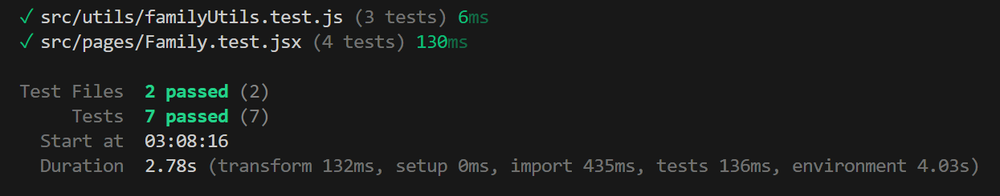
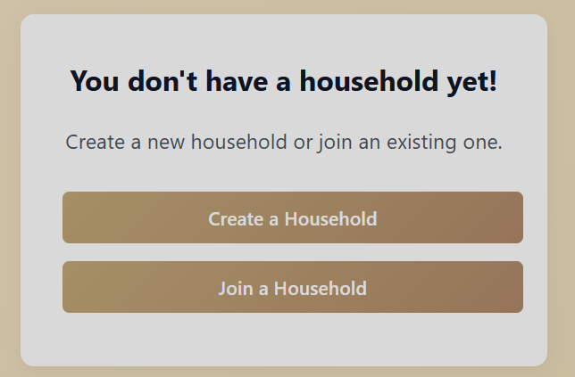
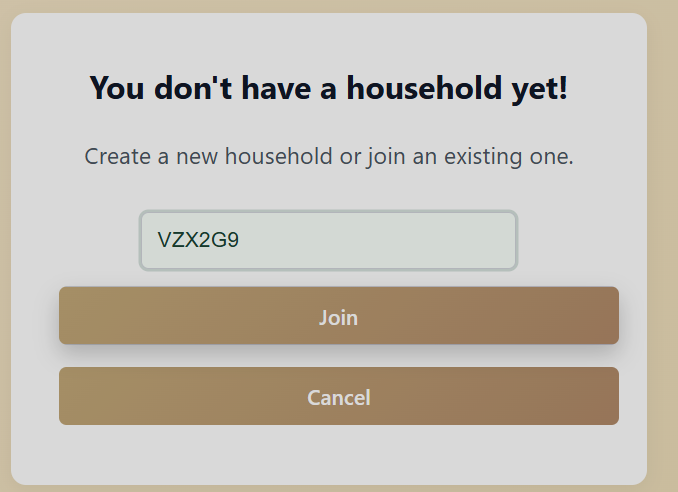
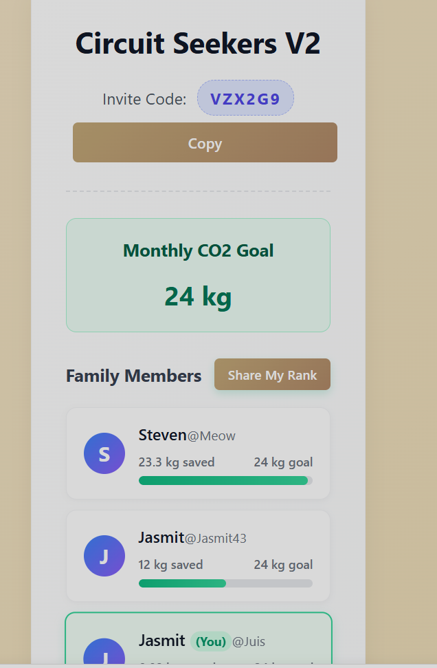
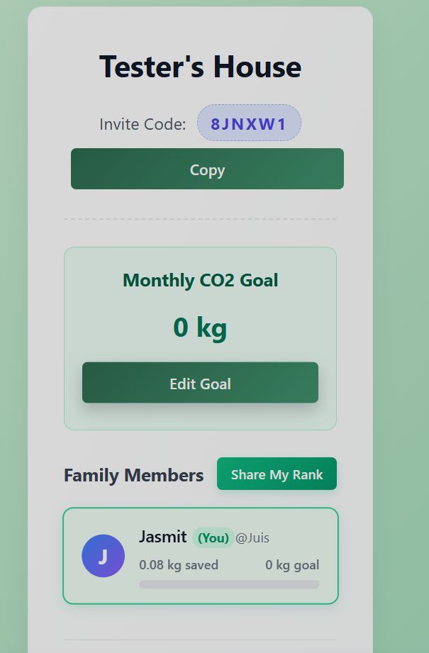
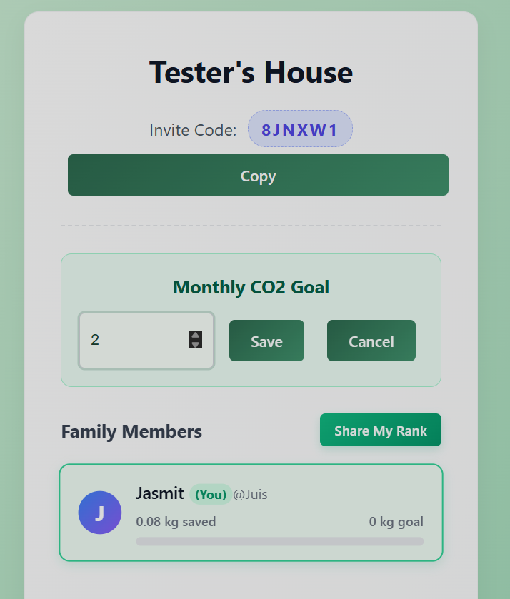
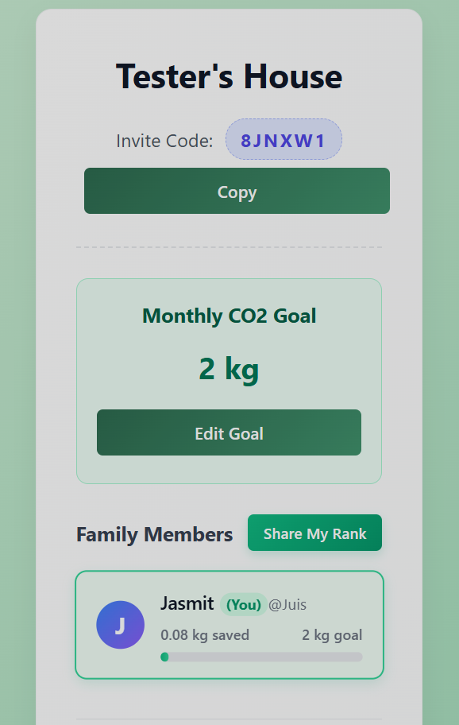
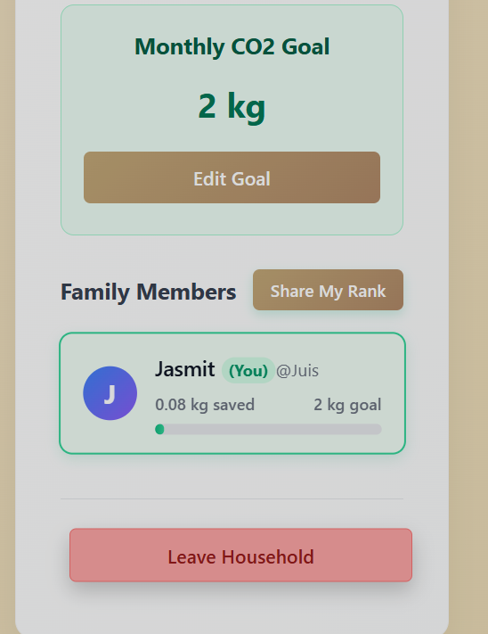
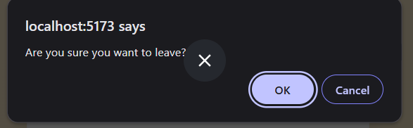
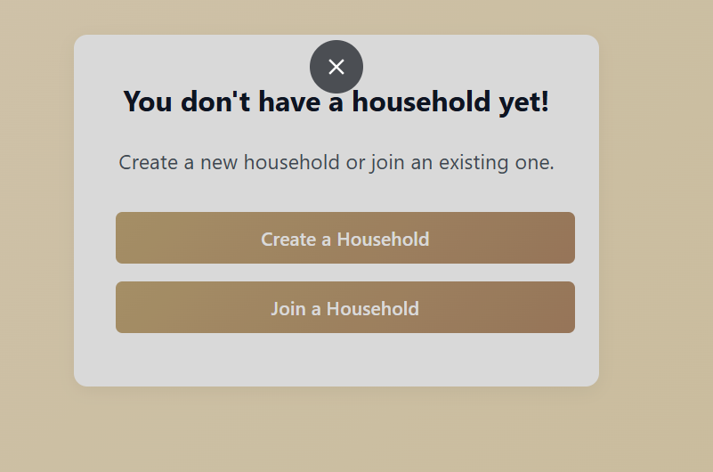

# Family Page Test Screenshots + Manual Tests
## Tests running using Vitest

## Manual Tests
### Join Valid Family - `FAM-IT-05`
1. On this selection click Join a Household
  

   
2. Enter the Invite code and click Join : `VZX2G9`
  

3. See the dashboard for circuit seekers V2
  

  

### Dashboard Goal Update Manual Test `FAM-IT-06`
1. Go to the family dashboard for which you are an admin of and click edit goal
  

2. Enter a valid goal and click save
  

3. Goal Successfully updates
  

  

### Leave Household Manual
1. Go to family dashboard and click the leave button
  

2. Confirm Leaving
  

3. You successfuly leave the family and end up on the join family screen
  

