# Settings Page Test Screenshots + Manual Tests
## Tests running using Vitest
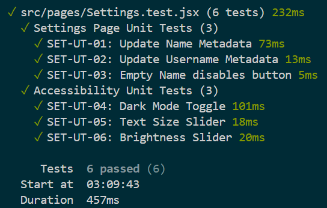
## Manual Tests
## `SET-IT-01`
1. Go to Settings
  
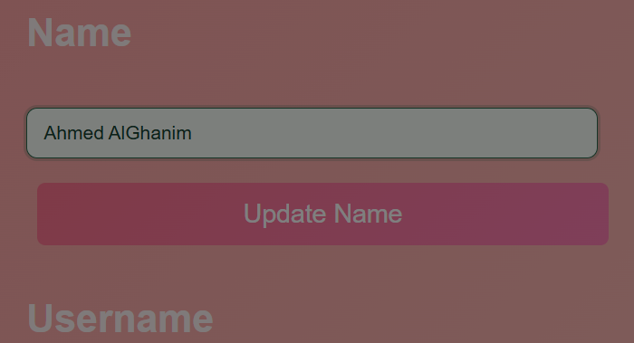
   
2. Update Name
  
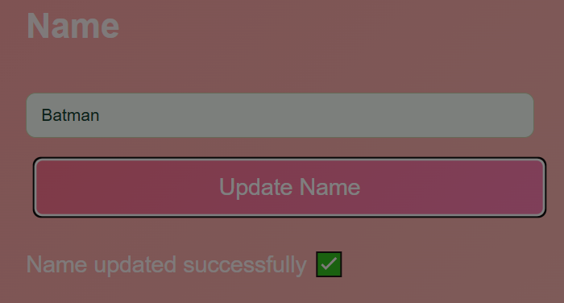

3. Go to family page
  
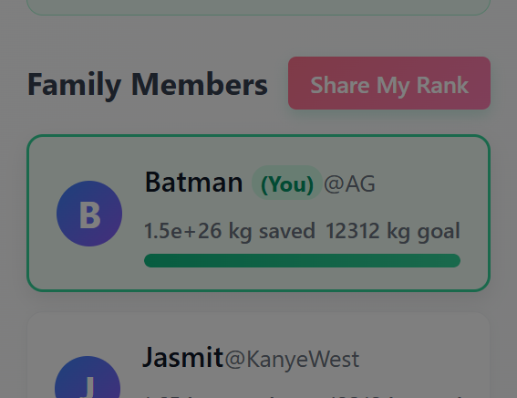

  

## `SET-IT-02`
1. Update Username
  
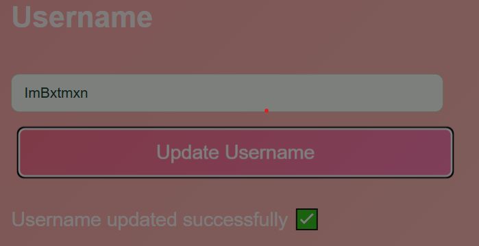
   
2. Go to family page
  
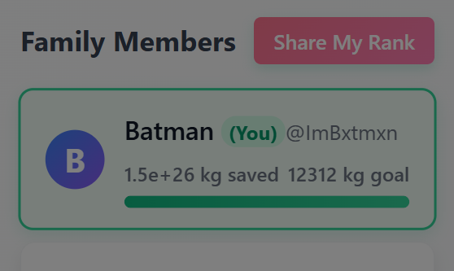

  

## `SET-IT-03`
1. Enable dark mode
  
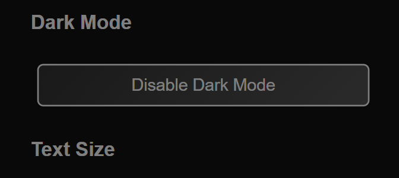
   
2. Refresh page
  
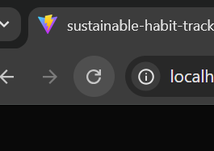

3. Data saved after refreshing
  
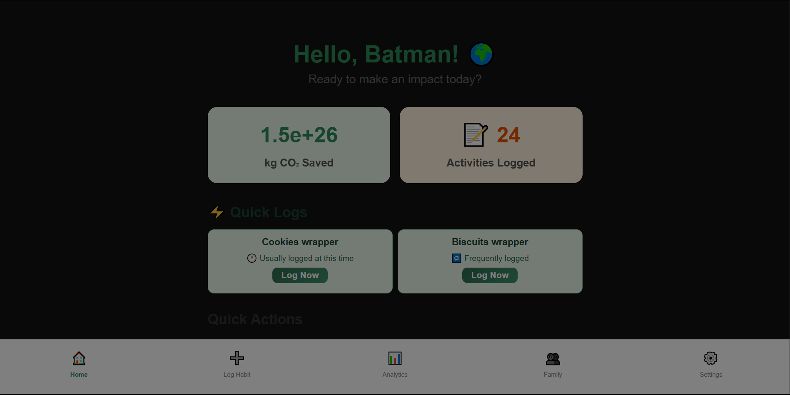

  

## `SET-IT-04`
1. Go to Settings>Accessibility and find Text size
  
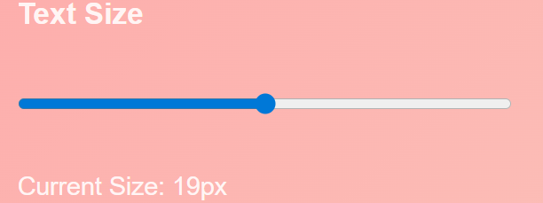
   
2. Increase text size
  
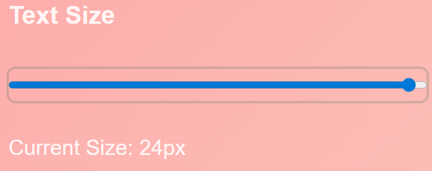

2. Navigate to home or other pages to see sized text
  
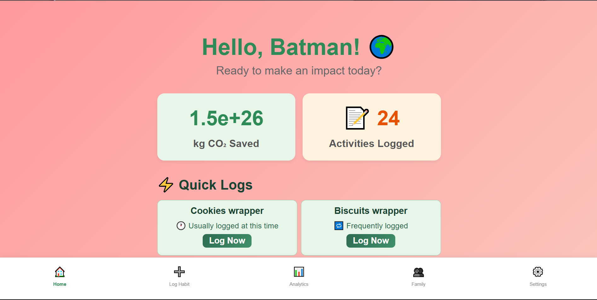
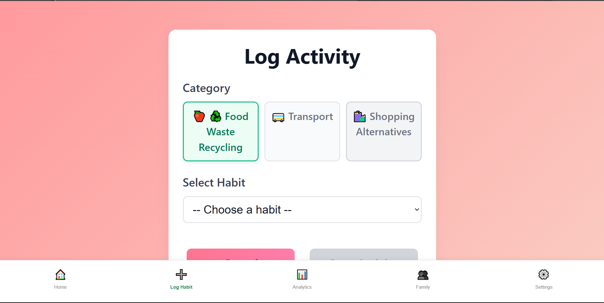
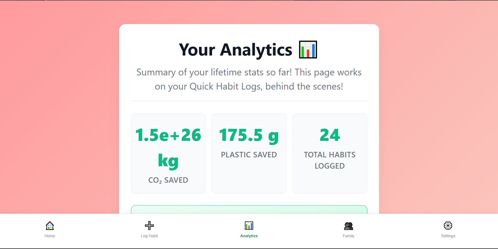
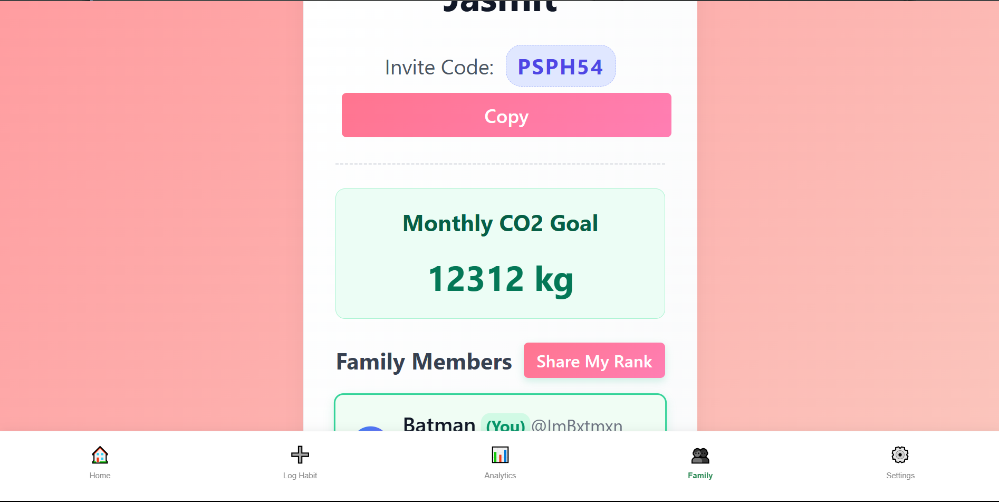

  

## `SET-IT-05`
1. Go to Settings>Accessibility and find Brightness
  
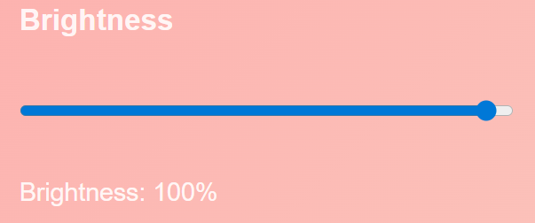
   
2. Reduce brightness
  
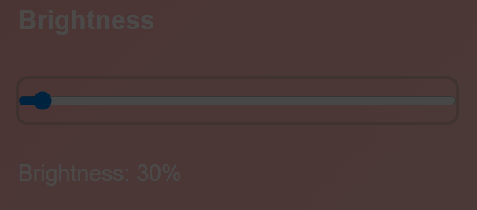

3. Refresh page
  
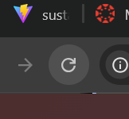

4. Brightness stored in localStorage
  
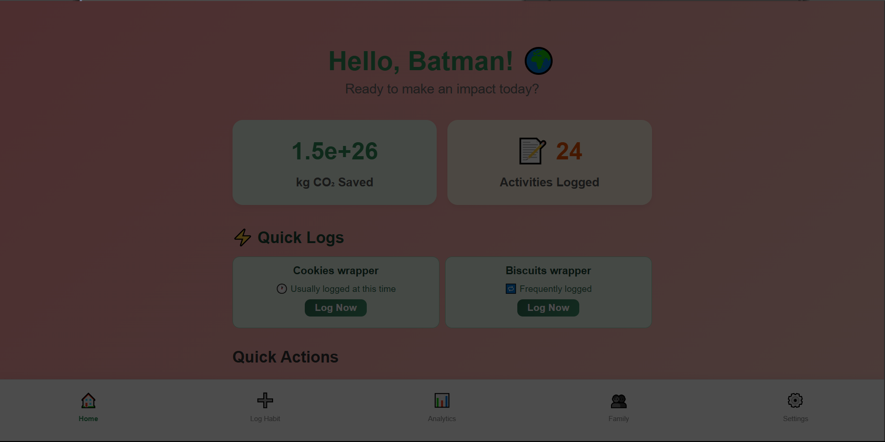

  
